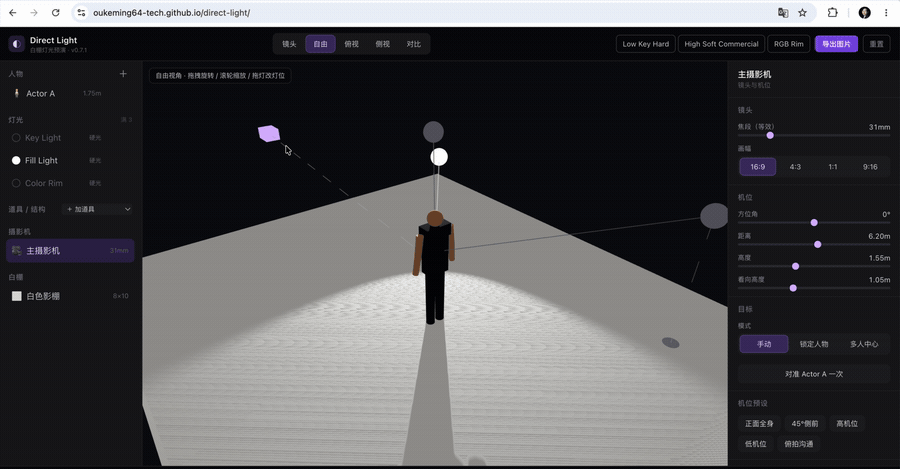

# Direct Light · White-Studio Lighting Previz

[](LICENSE)
[](https://oukeming64-tech.github.io/direct-light/showcase/)
[](https://oukeming64-tech.github.io/direct-light/)
[](https://github.com/oukeming64-tech/direct-light/releases)
[](https://tauri.app/)

> A lightweight lighting-previsualization sandbox for directors, DPs, and gaffers. Inside a standard white studio, preview in real time how actor blocking, light position, fixtures, modifiers, and white/colored light shape your subject and shadows.
>
> 中文文档（主文档）: [`README.md`](README.md)

**🔗 Project page: https://oukeming64-tech.github.io/direct-light/showcase/**  
**Live demo: https://oukeming64-tech.github.io/direct-light/** — no install, works on mobile too, auto-updated on every push to `main`.

A frontend-only web app, no backend. It optimizes for **communication, real-time feedback, and readability** — not physically accurate rendering. Unlike heavyweight DCC suites or paid set-lighting software, it's instant, install-free, and built for talking through a lighting setup with your crew.



> *Adjust the camera position → switch to the "lens" view and the camera's actual frame updates in real time. [Live demo](https://oukeming64-tech.github.io/direct-light/) ｜ [Desktop download](https://github.com/oukeming64-tech/direct-light/releases)*

## Release

**Current version: `v1.0.3` — fixes shadow light-bleeding on top of `v1.0.2` (user-customizable figure models): a per-light "normal bias" slider plus a "soft shadows (PCF)" toggle.** The white-studio lighting-previz core is feature-complete, with full runtime localization in 简体中文 / English / 日本語.

- 🌐 **Web**: <https://oukeming64-tech.github.io/direct-light/> — no install, auto-updated on every push to `main`.
- 🧭 **Project page**: <https://oukeming64-tech.github.io/direct-light/showcase/> — a polished GitHub Pages entry point; the live app stays at the root URL.
- 🖥️ **macOS desktop**: the `.dmg` on the [v1.0.3 release](https://github.com/oukeming64-tech/direct-light/releases/latest) (universal Apple Silicon / Intel, unsigned — see the desktop section for first-launch steps).
- 📜 Full per-version history in [`CHANGELOG.md`](CHANGELOG.md).

Starting from a simple prototype, Direct Light grew through ~ten iterations (v0.2–v0.10: multi-actor blocking, props/structures, poses, fixture presets, modifiers and in-studio control gear, camera controls, more lights, custom-fixture import/export, and the multilingual UI) and now ships as its first stable release.

## Screenshots

| Lower the key → the ground shadow stretches | Colored light tints the whole white studio | Switch to the camera's lens view |
| :---: | :---: | :---: |
|  |  |  |

## Features

- 🎬 **Studio + people** — adjustable white studio (size, wall/ceiling toggles, seamless cyclorama, wall/floor reflectance), a rigged simplified figure, multi-actor blocking (up to 5), pose presets and joint tuning.
- 🧍 **User-customizable figure models** — drop a `.glb` into `src/models/` and it auto-appears in the person panel's "Appearance → User Models" list, auto-scaled and grounded at runtime with no per-model config; ships with two new figures (Philosopher / Philosopher bust). The procedural dummy stays the default; custom models are opt-in.
- 💡 **Lighting** — up to 6 lights (hard / soft / panel) with position, height, distance, angle, intensity, color, color temperature, beam angle, and softness; drag-to-place; target lock (manual / lock-to-person / center-of-people).
- 🔦 **Fixture library** — 8 semantic fixture presets (COB, Nanlux Evoke 600C, LED panel, RGB tube, Fresnel, etc.); apply default light quality in one click, then fine-tune by hand.
- 🎛️ **Modifiers + standalone control gear** — softbox / grid / reflector / diffusion on the light, plus black flag / reflector board / diffusion frame as in-studio gear, each with a director-readable approximate optic.
- 🏠 **Props & structures** — tables, chairs, plinths, mannequins, a round live-stream stage, backdrops; draggable, rotatable, resizable; people can be placed onto supports and follow them live.
- 🎥 **Views + camera** — camera / free-orbit / top / side views; camera azimuth, distance, height, focal length, aspect ratio, position presets, and "frame from free view".
- 🔀 **A/B compare · save · export** — presets saved to browser localStorage, frozen A/B compare with a difference summary, and preview-image export for sharing with the crew.
- 🌐 **Multilingual UI** — switch Simplified Chinese / English / Japanese at runtime; language only changes UI display and never enters scenes, presets, A/B snapshots, or custom fixture data.

## Quick start

Prefer not to run it locally? Just open the [live demo](https://oukeming64-tech.github.io/direct-light/). To develop locally:

Requires **Node.js >= 20.19** (20 / 22 LTS recommended) + npm.

```bash
git clone https://github.com/oukeming64-tech/direct-light.git
cd direct-light
npm install
npm run dev        # http://localhost:5173
```

It opens to a usable default studio (one actor, Key/Fill/Rim lights, a camera). Drag a light, change its height or color, add a prop — the image and shadows update live.

Scripts:

```bash
npm run build      # tsc -b type-check + vite production build to dist/
npm run lint       # eslint
npm run preview    # preview the production build
```

## Desktop app (macOS)

Besides the web version, Direct Light can be packaged as a macOS desktop app via [Tauri](https://tauri.app/) (small bundle, uses the system WebView).

- **Download**: grab the `.dmg` from [Releases](https://github.com/oukeming64-tech/direct-light/releases) (universal binary — Apple Silicon & Intel).
- **First launch blocked** (the app is unsigned): System Settings → Privacy & Security → "Open Anyway".
- **Build it yourself** (needs the [Rust](https://www.rust-lang.org/tools/install) toolchain + Xcode Command Line Tools):

  ```bash
  npm install
  npm run tauri dev     # live desktop dev
  npm run tauri build   # outputs .app / .dmg to src-tauri/target/release/bundle/
  ```

- **Releasing**: push a `v*` tag (`git tag v0.7.2 && git push origin v0.7.2`); GitHub Actions builds the universal app on a macOS runner and attaches it to a Release (draft by default).

## Tech stack

Vite · React 19 · TypeScript · React Three Fiber + drei (Three.js) · Zustand · Tailwind CSS · Tauri (desktop packaging).

## Project structure

| Path | Responsibility |
| --- | --- |
| `src/app` | App shell, layout, stage, A/B compare |
| `src/scene` | All Three.js / R3F 3D content (studio, people, light rig, gear, camera rig) |
| `src/state` | Zustand store (thin composition + `actions/*` factories) |
| `src/data` | Pure data & specs (default scene, rendering numbers, fixture/modifier/pose/camera presets) |
| `src/domain` | Pure logic (camera math, gear optics, scene diff/migration, light brief) |
| `src/ui` | Parameter panels, object list, top bar |
| `src/lib` | Utilities (color, geometry, localStorage) |

See [`ARCHITECTURE.md`](ARCHITECTURE.md) (Chinese) for full module boundaries, and [`CONTRIBUTING.md`](CONTRIBUTING.md) to contribute.

## Known limits (first release)

- Up to 6 lights (`MAX_LIGHTS = 6`); the default scene still ships 3 (Key/Fill/Rim) — multi-light management landed in **v0.8**.
- Custom fixtures (v0.9): save the current light as a fixture, store locally, and JSON import/export. Custom fixtures live in localStorage only — moving them across devices / sharing is via the JSON export / import.
- Multilingual UI (full support since v1.0): a top-bar language menu switches 简体中文 / English / 日本語; UI chrome, built-in display labels, and derived A/B copy are all localized. User-entered names, brand/model names, units, and data ids are never translated. See [`V0_10_I18N_SPEC.md`](V0_10_I18N_SPEC.md).
- Desktop-first; narrow mobile responsive layout is scheduled separately.
- The renderer is a communication-oriented approximation, not a physically accurate simulation. Studio reflectance, soft light, colored spill, and gear optics all favor readable, stable, real-time output.
- Black flag / reflector board / diffusion frame optics are runtime-derived approximations (no real mesh shadow for the flag; the reflector is a virtual weak fill; the diffusion frame modifies effective light quality).

## License

[MIT](LICENSE) © 2026 Keming Ou. Changelog: [`CHANGELOG.md`](CHANGELOG.md). Roadmap: [`ROADMAP.md`](ROADMAP.md) (Chinese).

## Acknowledgements

Special thanks to Dr. Zhang from Stanford ([@zczam](https://github.com/zczam)) for the user-customizable figure models — bringing a little philosophy and dungeon flavor to the otherwise boring white studio.
